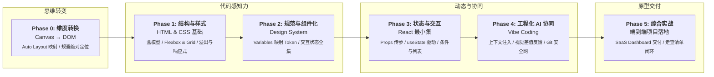
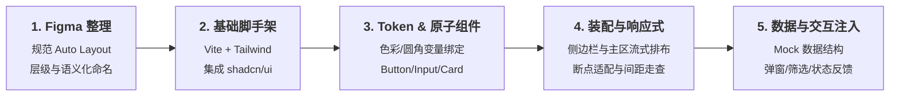

# UI Designer → Vibe Coding 学习路线图

很多设计师尝试用 AI 生成网页时，常会遇到同一种挫败感：截了一张自认为完美的 Figma 设计图丢给 AI，生成的代码要么布局完全散架，要么文字一行变两行就破坏了整张卡片；想让 AI 改个小圆角，又把其他地方的间距改乱了。

这通常不是因为 Prompt 写得不够客气，也不是因为设计师不懂算法，而是**画布思维（Canvas）与浏览器文档流（DOM）之间存在一道翻译鸿沟**。

Figma 里的图层是自由绝对坐标的容器，而浏览器是基于流式布局、盒模型与状态渲染的树状系统。当设计能够用工程可解析的语言精确定义，AI 才是最高效的实现搭档。本文梳理一条让 UI 设计师用最小认知成本掌握 Vibe Coding 的路径，目标是独立交付可运行、可交互的高保真原型 Demo。

---

## 路线概览



---

## Phase 0：从画布思维到 DOM 思维

学代码之前，最先需要调整的是在 Figma 里的作图习惯。如果设计稿充满手工拖拽定位、解绑的文本框与未命名的 Group，AI 就算接入识图模型也只能猜布局。

### 1. Auto Layout 映射表

Auto Layout 的本质就是 CSS Flexbox。熟练使用 Auto Layout 的设计师，其实已经掌握了现代前端最核心的布局机制：

| Figma Auto Layout 属性     | 对应 CSS 属性 / Tailwind 类名                              | 实际布局作用        |
| ------------------------ | ---------------------------------------------------- | ------------- |
| Horizontal Direction     | `display: flex; flex-direction: row` (`flex-row`)    | 水平横向排布子项      |
| Vertical Direction       | `display: flex; flex-direction: column` (`flex-col`) | 垂直纵向排布子项      |
| Gap between items        | `gap: 16px` (`gap-4`)                                | 子项之间的固定间距     |
| Padding (X / Y)          | `padding: 12px 16px` (`px-4 py-3`)                   | 容器内边距         |
| Resizing: Fixed          | `width: 240px` (`w-60`)                              | 锁定固定宽度        |
| Resizing: Hug contents   | `width: fit-content` (`w-fit`)                       | 尺寸由子内容撑开      |
| Resizing: Fill container | `flex: 1 1 0%` 或 `width: 100%` (`flex-1` / `w-full`) | 自动撑满父容器剩余空间   |
| Alignment: Center        | `align-items: center` (`items-center`)               | 交叉轴居中对齐       |
| Alignment: Space between | `justify-content: space-between` (`justify-between`) | 主轴两端对齐，间距自动均分 |

### 2. 避免绝对定位陷阱

- **Canvas 思维**：把元素直接叠放在页面某坐标 `(X: 120, Y: 340)`。
- **DOM 思维**：所有元素顺着文档流向下或向右流动。除了全局浮动的 Tooltip、Modal、Toast，绝大部分业务界面都应该用嵌套容器包覆。滥用 `position: absolute` 会让响应式适配彻底失效。

---

## Phase 1：Web 核心基础（读懂结构与样式）

目标不是让你成为熟练的手写前端，而是**能够看懂 AI 输出的代码，并准确指出排版 bug 所在**。

### 1. HTML 语义骨架

网页本质上是由盒子嵌套而成的树状结构：

- `header` / `nav`：顶部栏与导航容器。
- `main` / `section` / `aside`：主体内容区、独立功能块与侧边栏。
- `button` 与 `a`：有明确行为区别。触发操作（提交、弹窗）用 `button`，页面跳转用链接 `a`。
- `input` / `select` / `form`：表单收集输入。

### 2. 必须摸透的 CSS 核心概念

与视觉直接绑定的样式属性，必须搞清楚它们在浏览器中的计算方式：

- **盒模型（Box Model）**：现代 Web 统一使用 `box-sizing: border-box`。这意味着元素的 `width` 已经包含了 `padding` 和 `border`，不会因为加了内边距导致卡片换行。
- **Flexbox 与 Grid**：Flex 负责一维线性排布（导航栏、卡片内部元信息），Grid 负责二维网格布局（响应式卡片网格、复杂看板仪表盘）。
- **Overflow**：`overflow: hidden`（裁剪与防溢出）、`overflow-y: auto`（局部滚动条）。遇到“页面被撑出横向滚动条”时，90% 是子元素宽度超出且未声明父级截断。
- **响应式断点**：掌握 Media Query（`sm: 640px`, `md: 768px`, `lg: 1024px`, `xl: 1280px`）。响应式不是等比缩放整个网页，而是重构流向：桌面端的双栏布局在移动端折叠为单栏，侧边栏变为底部导航或汉堡抽屉。

> **实战练习**：找一个自己曾经做过的 Landing Page 静态稿，让 AI 生成纯 HTML+Tailwind 代码，拉伸浏览器窗口观察断点变化，排查并手动修复溢出与错位。

---

## Phase 2：从视觉符号到 Design Tokens & 组件变体

在大型设计系统或可维护的原型中，散落在各处的硬编码数值（如 `#3B82F6`、`16px`）是导致样式失控的主因。

### 1. Design Token 标准化

把 Figma Variables 映射为 CSS 变量或 Tailwind 预设配置：

```css
:root {
  /* 颜色层级：语义化优先 */
  --color-primary: #2563eb;
  --color-background: #ffffff;
  --color-surface: #f8fafc;
  --color-text-main: #0f172a;
  --color-text-muted: #64748b;

  /* 基础几何步进 */
  --space-2: 8px;
  --space-4: 16px;
  --space-6: 24px;
  --radius-sm: 6px;
  --radius-md: 10px;
  --radius-lg: 16px;
}
```

在与 AI 协作时，规定“所有间距与颜色只能从上述配置中选择”，能直接扼杀 80% 杂乱无章的生成样式。

### 2. 建立完整的组件状态模型

设计师做组件时常只画一个好看的默认帧，但实际界面永远处于各种边界状态。一个合格的组件必须具备完整状态定义：

```text
Button 组件结构
├── 变体 (Variant): Primary / Secondary / Outline / Ghost / Destructive
├── 尺寸 (Size): Small / Medium / Large
└── 运行状态 (State):
    ├── Default (静止态)
    ├── Hover (悬浮)
    ├── Active (按压)
    ├── Focus (键盘聚焦，外发光)
    ├── Loading (加载中，禁用点击并显示 Spinner)
    └── Disabled (不可用，透明度降低置灰)
```

页面层级同理：任何数据展示区域（表格、列表、图表）在原型中都必须定义 **Loading 骨架屏**、**Empty 无数据占位图** 与 **Error 加载失败提示**。

---

## Phase 3：React 最小必要集（赋予动态交互）

不要去背 React 全家桶的底层源码与复杂优化，作为原型设计者，只需掌握 5 个核心交互支柱：

### 1. Props（接口传参）

组件就像带插槽的模板，外部传入不同的参数，渲染不同的内容：

```tsx
interface MetricCardProps {
  title: string
  amount: string
  trend: "up" | "down"
  percentage: string
}

export function MetricCard({ title, amount, trend, percentage }: MetricCardProps) {
  return (
    <div className="p-4 rounded-xl border bg-card text-card-foreground">
      <p className="text-sm text-muted-foreground">{title}</p>
      <h3 className="text-2xl font-bold mt-1">{amount}</h3>
      <span className={trend === "up" ? "text-emerald-600" : "text-rose-600"}>
        {trend === "up" ? "↑" : "↓"} {percentage}
      </span>
    </div>
  )
}
```

### 2. State 与交互触发

状态（State）是组件的即时记忆。状态一变，页面自动重新渲染：

```tsx
const [isOpen, setIsOpen] = useState(false)

return (
  <>
    <button onClick={() => setIsOpen(true)}>打开筛选面板</button>
    {isOpen && <FilterModal onClose={() => setIsOpen(false)} />}
  </>
)
```

### 3. 条件与列表渲染

- 条件控制：`{isLoading ? <Skeleton /> : <DataTable data={list} />}`
- 列表映射：用 `.map()` 将结构化 JSON 数组渲染成一组卡片。

---

## Phase 4：Vibe Coding 工业级工作流

Vibe Coding 不是天马行空的盲目尝试，而是**有边界的上下文注入 + 高频视觉反馈**。

### 1. 推荐技术栈

原型开发最重要的是生态成熟与即开即用，直接锁定这套组合：

- **工程底座**：`Vite + React + TypeScript`（秒级热更新，类型提示防低级拼写错误）。
- **样式工具**：`Tailwind CSS`（原子化样式，与 Design Token 深度契合）。
- **组件库**：`shadcn/ui`（代码直接复制进项目源码，样式完全可自定义，无第三方黑盒限制）。
- **图标集**：`Lucide React`（矢量符号库齐全，风格一致）。

### 2. 精确上下文注入机制

不要发一句“帮我写个用户中心”，应该向 AI 明确以下约束：

1. **角色与场景**：“实现一个 SaaS 后台的用户管理表格，包含筛选、分页与批量操作状态。”
2. **规范约束**：“严格遵循项目中的 Tailwind 配置与 shadcn/ui 组件库，不要引入额外的 CSS 模块。”
3. **结构定义**：“包含顶部搜索栏、状态下拉筛选（全部/激活/待审核）、以及一个每页 10 条的数据表格。”
4. **数据 Mock**：“生成包含 5 条模拟用户数据的 JSON 数组用于初始展示。”

### 3. 视觉反馈闭环（Visual Feedback Loop）

代码跑起来后，在浏览器中查看效果并与 Figma 对比。给 AI 提供反馈时，使用**工程化数值语言**替代感性词汇：

- ❌ 模糊反馈：“这个卡片看起来不太协调，间距怪怪的。”
- ✅ 精确反馈：“`MetricCard` 顶部标题与数值之间的间距偏大，请改为 `gap-1`（4px）；整个卡片的内边距请从当前的 `p-6` 统一调整为 `p-4`；同时卡片背景色改为 `bg-slate-50`。”

### 4. Git 变更安全网

AI 改代码时可能会意外破坏原本正常的布局。每一次主要功能或样式调整生效后，立即进行小步提交：

```bash
git add .
git commit -m "feat: 完成卡片组件与响应式断点适配"
```

当 AI 陷入逻辑死循环或把组件改散架时，直接用 `git diff` 查看改动，或者用 `git checkout .` 秒级撤销，退回安全检查点。

---

## Phase 5：端到端综合项目实战

找一个真正具备业务复杂度的原型项目（例如：**B2B 运营看板** 或 **AI 写作工作台**），按以下流水线完成交付：



### 交付清单校验表

- [ ] **视觉对齐**：内外边距、字阶字重、投影与圆角符合 Figma 定义的 Token 规范。
- [ ] **全响应式表现**：在 390px（手机）、768px（平板）、1440px（宽屏桌面）下无横向溢出，导航与内容流向自然切换。
- [ ] **状态完整性**：核心交互有清晰的 Hover、Active、Loading、Empty 占位及结果反馈。
- [ ] **交互闭环**：表单可输入校验、弹窗可打开关闭、列表支持基本搜索筛选。

---

## 结语

在 AI 辅助开发的范式下，设计师的竞争力从未被代码削弱，反而被赋予了更真实的表达力。

以前你的产物是静态画板或原型走查标注，常常在工程师还原环节丢失细节；现在通过理解组件化逻辑与流式布局，你可以亲自利用 AI 把 Figma 设计转化为触手可及、可交互验证的真实界面。
