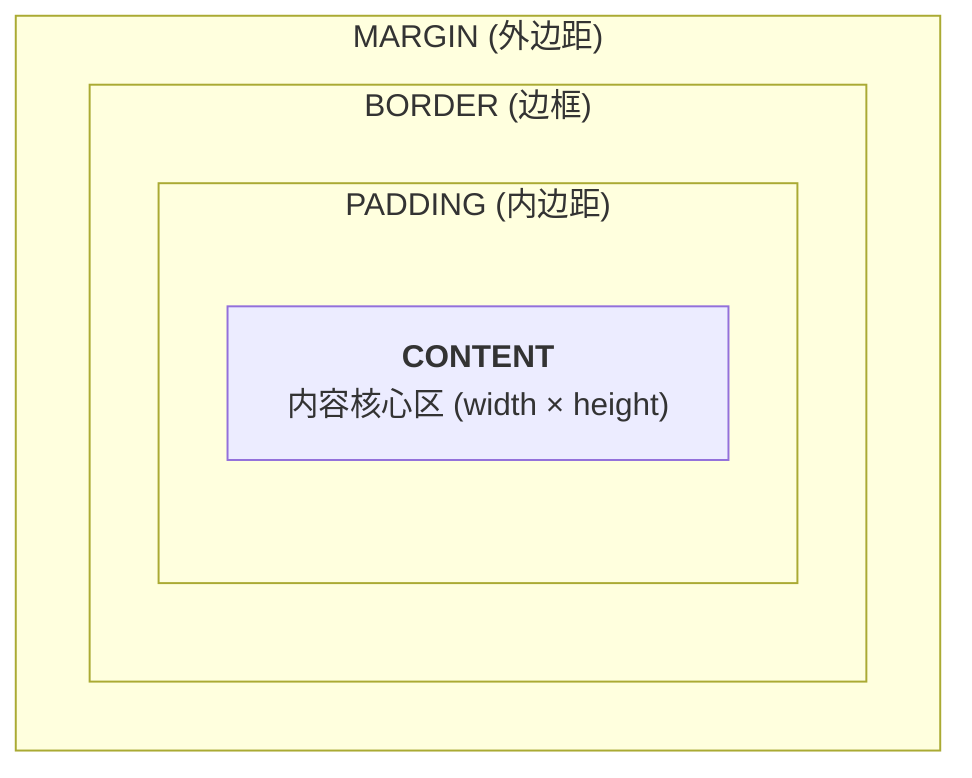
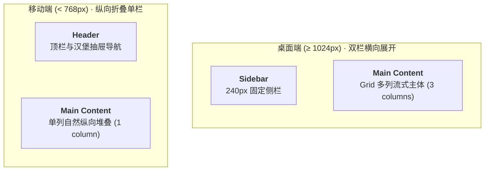

# 读懂代码骨架：UI 设计师的 HTML 与 CSS 感知力

很多设计师在尝试用 AI 辅助写页面（Vibe Coding）时，经常会陷入一种拉锯战：

让 AI 生成了一个卡片组件，在浏览器里预览时，要么左侧图标被挤成了椭圆，要么文本一长就把整个布局撑出了横向滚动条。你想让 AI 修正，只能打出一串感性的描述：“这个卡片间距有点怪”、“右边空太多了”、“图标别变形”。AI 试探着改了一版，往往是这里修好了，另一个角落又莫名其妙塌陷下去。

这种低效拉锯的根源，不在于你的审美判断，而在于**反馈语言的信噪比过低**。

你不需要成为一个天天手写复杂业务逻辑的前端工程师。但在 Vibe Coding 的工作流里，你必须具备**代码感知力**——能够看懂 AI 输出的骨架，知道哪一行样式在掌管几何边界，并在浏览器出现错位时，利用开发者工具一眼揪出那个出问题的属性。

上一篇 [[01-re-understand-figma|Phase 0]] 我们从画板端梳理了 Frame 与 Auto Layout 的本质。这一篇我们进入浏览器的世界，把那些在设计稿里熟悉的间距与对齐，映射到真实的 HTML 与 CSS 物理规则中。

---

## 打开浏览器的检查器

在看代码之前，先打开你每天都在用的浏览器（Chrome、Edge 或 Safari）。

在任何网页上点击右键，选择 **“检查”（Inspect）**，或者直接按下快捷键 `Cmd + Option + I`（Windows 为 `Ctrl + Shift + I`），弹出的就是前端工程师最核心的工作台：**DevTools（开发者工具）**。

对于设计师来说，初期只需要关注两个区域：

1. **Elements（元素面板）**：左侧展示当前页面的 HTML 标签树。鼠标在标签间移动时，浏览器视图中对应的元素会亮起蓝、绿、橙色的半透明遮罩。
2. **Styles（样式面板）**：右侧展示当前选中元素的 CSS 规则。你可以直接在这里双击修改数值、勾选或取消某行属性，改动会实时反映在画面上。

把 DevTools 当作你的“实时标注切片器”。当界面表现异常时，不要退回聊天窗口盲猜 Prompt，先在 DevTools 里点一下那个异常的元素。

---

## 读懂 HTML 树状骨架

Figma 里的图层是树状的，网页的 DOM（Document Object Model）也是树状的。

很多初学者或者低质量的 AI 代码，通篇只有一种标签：`<div>`。如果一个页面由几十个嵌套的 `div` 组成，就成了前端常说的“Div 汤（Div Soup）”。这就像你在 Figma 里把所有图层都命名为 `Frame 29384` 一样，不仅毫无可读性，还会丢失浏览器的默认行为与无障碍访问支持。

在审视 AI 生成的 HTML 时，抓出以下四大类核心标签即可：

### 容器与区块标签
定义界面的宏观区域，对应设计稿的一级 Frame：
- `<header>`：页头、全局顶部导航栏。
- `<nav>`：导航链接集合。
- `<main>`：页面的核心内容区（一个页面原则上只有一个）。
- `<aside>`：侧边栏、辅助信息卡片。
- `<section>`：独立的内容分块（如 Landing Page 中的 Feature 区块、Pricing 区块）。
- `<footer>`：页脚、版权与底栏链接。

### Button 与 a 的行为边界
这是设计稿转代码时最常被搞混的地方：
- `<button>`：**执行交互动作**。弹窗、提交表单、展开折叠、触发下拉菜单，只要不需要改变页面网址（URL），必须使用 `button`。
- `<a>`（Anchor 链接）：**改变页面地址与导航跳转**。点击后跳到另一个页面或锚点时使用。

如果 AI 把一个“保存设置”的按钮写成了 `<a href="#">`，或者把一个导航菜单项写成了带点击事件的 `<button>`，直接让它纠正。语义错误会导致键盘 Tab 键聚焦混乱与浏览器默认行为失常。

### 表单与输入标签
承载用户输入的交互单元：
- `<input>`：单行输入框。注意看它的 `type` 属性（`text`、`password`、`email`、`checkbox`），不同类型决定了移动端弹出的软键盘类型。
- `<textarea>`：多行文本输入区。
- `<select>`：原生下拉选择器。

### 文本与多媒体标签
- `<h1>` ~ `<h6>`：标题层级。从页面的主标题到卡片的小标题，必须保持合理的阶梯，不能跳着乱用。
- `<p>`：正文段落。
- `<span>`：行内小文本碎片（如标签 Tag 里的文字、状态高亮文本）。
- `` 与 `<svg>`：位图与矢量图标。图标类元素优先使用内联 `<svg>` 或组件化图标，避免被误写成带有固定拉伸比的图片。

---

## 盒模型与几何边界

在 DevTools 的 Styles 面板最底部，你会看到一个四层嵌套的同心矩形图。这就是 Web 排版最底层的基石：**盒模型（Box Model）**。



从内到外分别是：
1. **Content（内容区）**：文字、图片或子元素实际占据的区域。
2. **Padding（内边距）**：内容与边框之间的呼吸空间（对应 Figma Auto Layout 的 Padding）。
3. **Border（边框）**：盒子的描边（对应 Figma 的 Stroke）。
4. **Margin（外边距）**：盒子与相邻其他盒子之间的距离。

### 为什么必须锁定 border-box

早期 Web 默认遵循 `content-box` 计算方式：如果你给一个卡片设置 `width: 300px; padding: 20px; border: 2px solid #000;`，浏览器最终渲染出来的总宽度是：

$$300 + 20 \times 2 + 2 \times 2 = 344\text{px}$$

原本算好能并排摆放的 3 张卡片，瞬间因为多出来的 44px 被挤到下一行。

现代 Web 开发的通用标准是全局声明：

```css
* {
  box-sizing: border-box;
}
```

在 `border-box` 下，你声明的 `width: 300px` 就是盒子的最终外框边界。Padding 和 Border 只会向内压缩内容空间，不会撑大整个盒子。**这与 Figma 的绘制逻辑完全一致。** 检查 AI 代码时，如果发现加了 Padding 后尺寸异常变大，第一时间看是否漏掉了全局的 `border-box`。

### Padding、Gap 与 Margin 的边界

在组织元素间距时，优先遵循现代布局习惯：

- **容器内部安全区**：用 `padding`（如卡片四周留白）。
- **相邻子项间隔**：**优先用父容器的 `gap`，慎用子项的 `margin`**。
  - 在过去没有 `gap` 时，前端习惯给每个子项写 `margin-right: 16px`，然后用 `:last-child` 清除最后一项的外边距，极易漏写导致布局错位。
  - 现代布局中，直接在父级 Flex / Grid 上声明 `gap`，天然对应 Figma 的 Gap 机制，干净且无副作用。
- **模块与模块的大区隔**：在独立 Section 外层使用单向的 `margin-bottom` 或统一由页面外框的 `gap` 驱动。

---

## Flexbox 与 Grid 布局机制

Auto Layout 解决了一维排列，而复杂的看板则需要二维网格。转换到代码中，对应的是 `display: flex` 与 `display: grid`。

### Flexbox 线性排布与抗压计算

绝大部分组件级排布（导航栏、卡片内图文、按钮组）都运行在 Flexbox 之下：

```css
.card-header {
  display: flex;
  flex-direction: row;
  align-items: center;
  justify-content: space-between;
  gap: 12px;
}
```

用 [Tailwind CSS](#附录-写给设计师的-tailwind-极简指南) 表达就是极简的一行：`flex items-center justify-between gap-3`（如果你对这种类名简写还不熟悉，文末附录有专门针对设计师视角的拆解）。

这里有三个决定子项伸缩的关键属性（在 Tailwind 中表现为简写）：

| CSS 属性 | 对应含义 | 常见 Bug 场景与解法 |
| :--- | :--- | :--- |
| `flex-grow: 1` (`flex-1`) | 吸收剩余空间（对应 Figma 的 `Fill`） | 搜索框在操作栏中需要自适应拉长时使用。 |
| `flex-shrink: 0` (`shrink-0`) | **禁止被挤压收缩** | **高频踩坑点**：列表项左侧有个 24px 图标，右侧文本很长时，图标突然被挤成了扁椭圆。原因就是图标默认参与了挤压计算，给图标加上 `shrink-0` 即可锁定物理尺寸。 |
| `flex-basis` | 伸缩计算的基础初始尺寸 | 决定分配空间前的起始量度。 |

### 用 CSS Grid 搭建二维看板

当界面出现整齐的卡片矩阵、仪表盘多列看板、或者跨单元格排布（Bento Grid）时，如果继续用 Flexbox 嵌套，会导致代码层级极度臃肿：

```text
Flexbox 嵌套实现 3 列矩阵（反模式）：
<div class="flex flex-col">
  <div class="flex flex-row">...</div>
  <div class="flex flex-row">...</div>
</div>
```

一旦要在小屏上折叠成单列，或者让第一行第一张卡片横跨两列，这种死板的结构就会彻底瘫痪。

正确的做法是直接使用 CSS Grid：

```css
.dashboard-grid {
  display: grid;
  grid-template-columns: repeat(3, 1fr);
  gap: 24px;
}

/* 第一张卡片横跨两列 */
.dashboard-grid > .featured-card {
  grid-column: span 2;
}
```

用 Tailwind 表达非常直观：

```html
<div class="grid grid-cols-1 md:grid-cols-3 gap-6">
  <div class="md:col-span-2 bg-card p-6 rounded-xl">主要趋势看板</div>
  <div class="bg-card p-6 rounded-xl">即时动态</div>
</div>
```

**何时提醒 AI 重构？**
当你要求 AI 写一个 4 列商品流或 3 列卡片列表，发现它写出了多层包裹的 `flex-col` + `flex-row` 时，直接指令：“将此处布局重构为 CSS Grid，使用 `grid-cols-X` 和 `gap` 控制排布”。

---

## 溢出与脱流排查

界面开发中最令人抓狂的两类视觉 Bug，一类是**横向撑破滚动条**，另一类是**浮动层定位乱飞**。

### 横向滚动条排查

网页默认应当只在垂直方向顺畅滚动。如果在手机端或窄窗口下，整个网页可以左右横向晃动，说明某个子盒子的计算宽度超出了视口宽度。常见诱因与对应解法：

1. **检查是否有死板的 Fixed 宽度**：在卡片或容器上直接写了 `width: 500px` 或 `w-[500px]`。在小屏设备（如 390px 宽度的 iPhone）上，它必定会把视口撑爆。
   - **修复原则**：将固定宽度改为 `width: 100%; max-width: 500px;`（Tailwind: `w-full max-w-[500px]`）。
2. **文本不换行导致撑开**：长英文单词、未断行的 URL 或长数字，默认可能不会自动折行。
   - **修复原则**：为文本容器加上 `break-words` 或 `truncate`（单行截断并显示省略号）。
3. **定位容器未裁剪**：某些做装饰背景的大尺寸渐变圆球超出屏幕边界。
   - **修复原则**：在页面的最外层容器上加上 `overflow-x: hidden`。

```css
/* 局部内容滚动（如表格横向滑动、抽屉内容纵向滚动） */
.table-container {
  overflow-x: auto; /* 仅在超出时显示局部水平滚动条 */
}
```

### Absolute 定位的锚点陷阱

在 Figma 里给图层打上 `Absolute position` 图钉时，它是相对于父级 Frame 定位的。

但在 CSS 里，写了 `position: absolute` 的元素，**默认会一直往上层找，直到找到第一个声明了 `position: relative`（或 absolute/fixed）的祖先容器**；如果找不到，它就会直接相对整个浏览器窗口定位。

这就解释了为什么 AI 写的头像状态小圆点（Badge）或者卡片右上角的关闭按钮，有时候会莫名其妙飞到屏幕的最左上角：

```html
<!-- 错误示范：父级没有 position: relative -->
<div class="p-4 bg-white">
  <button class="absolute top-2 right-2">✕</button> <!-- 飞出了卡片外 -->
</div>

<!-- 正确示范：父级声明 relative，成为定位基准锚点 -->
<div class="relative p-4 bg-white">
  <button class="absolute top-2 right-2">✕</button> <!-- 精确停靠在卡片右上角 -->
</div>
```

### z-index 层级规范

当元素脱离正常文档流后，重叠顺序由 `z-index` 决定。

避免随手写 `z-[9999]` 或 `z-[99999]` 这种“军备竞赛”代码。在原型中建立清晰的三层心智模型即可：
- `z-10`：基础浮层（卡片内部的角标 Badge、轻量微交互）。
- `z-20` ~ `z-30`：页面级悬浮构件（固定在顶部的吸顶导航栏 `sticky top-0`、悬浮操作按钮）。
- `z-50` 以上：全局阻塞遮罩（模态弹窗 Modal、全屏抽屉 Drawer、全局 Toast 提示）。

---

## 响应式断点与流向重构

Figma 原型通常是在固定画板上完成的（例如桌面端 1440px，移动端 390px）。但真实浏览器有上千种不同的屏幕宽度。

### 媒体查询不是等比缩放

响应式设计的核心不是把桌面网页“缩小”放到手机上，而是**重构内容流向**：



在现代 CSS 中，这通过媒体查询断点（Breakpoints）实现。Tailwind 默认采用**移动优先（Mobile First）**策略：

```html
<!-- 移动端默认单列 (w-full)，在中等屏幕以上变为双栏 (md:grid-cols-2)，大屏上变为三栏 (lg:grid-cols-3) -->
<div class="grid grid-cols-1 md:grid-cols-2 lg:grid-cols-3 gap-6">
  <!-- 卡片项 -->
</div>
```

标准断点参考：
- `sm`（640px）：横屏手机 / 小平板。
- `md`（768px）：标准平板竖屏（双栏到单栏折叠的关键分水岭）。
- `lg`（1024px）：笔记本电脑屏幕。
- `xl`（1280px）/ `2xl`（1536px）：宽屏台式显示器。

### 相对单位与视口尺寸

- `px`：物理绝对像素。适合用于精确的小边框（`border: 1px solid`）、细小阴影偏移或锁定物理尺寸的小图标。
- `rem`（Root EM）：相对于页面根节点（`<html>`）字号的倍数。浏览器默认根字号是 `16px`，因此 `1rem = 16px`。使用 `rem` 能让视力障碍用户在调整系统全局字体大小时，界面的文本与间距按比例自适应缩放。
- `vh` / `vw`：视口高度与宽度的百分比（`100vh` 即当前窗口的完整高度）。
  - *移动端避坑*：在手机 Safari 上，传统的 `100vh` 常常会被底部弹出的地址栏和导航条遮挡截断。现代规范中建议使用 `100dvh`（Dynamic Viewport Height），它会随浏览器地址栏的展开与收起实时计算真实的可见高度。

---

## 用工程语言向 AI 下达指令

掌握了基础概念后，你在日常 Vibe Coding 时的沟通方式将发生质的改变。

### DevTools 审查流程

1. **精准选中**：按下 `Cmd + Shift + C`，鼠标移到网页上点击那个错位的元素。
2. **观察几何边界**：
   - 蓝色区域是内容本身。
   - 绿色区域是 Padding。
   - 橙色区域是 Margin。
   - 如果发现元素被挤得很窄，看一下 Styles 面板里是否计算出了 `width: 0` 或者由于父级 `flex` 没有分配空间。
3. **就地篡改测试**：
   - 在 Styles 面板里直接取消勾选某条样式，或者把 `gap: 8px` 改成 `gap: 16px`，观察画面是否恢复正常。
   - 一旦在 DevTools 里找到了正确的属性，你就拿到了向 AI 下达精准修改指令的全部信息。

### 指令对比示例

| 场景 | 模糊且低效的指令（让 AI 猜） | 精确高效的工程指令（直击要害） |
| :--- | :--- | :--- |
| **卡片被横向撑开** | “手机上看这个卡片太宽了，排版破损了，调小一点。” | “卡片根容器请将固定宽度移除，改为 `w-full max-w-md mx-auto`；内部标题添加 `truncate` 防止单行过长撑开父级。” |
| **左侧图标被挤扁** | “头像图标看起来像个椭圆，帮我恢复原样。” | “卡片内部左侧的头像容器请添加 `shrink-0`，确保在右侧多行文本撑开时不被 Flexbox 挤压。” |
| **浮层位置错乱** | “右上角那个关闭小叉叉飞到屏幕外面去了。” | “父级卡片容器缺少相对定位基准，请为父容器添加 `relative` 类，并将关闭按钮设为 `absolute top-3 right-3`。” |
| **手机端布局不折行** | “三张卡片在小屏幕上挤在一堆，看不清楚字。” | “将卡片网格容器从目前的固定横向 Flex 排布改为响应式 Grid：小屏为 `grid-cols-1`，`md` 断点以上再应用 `grid-cols-3`，并统一保持 `gap-6`。” |

---

## 走查与核对清单

当你完成一段由 AI 协助产出的页面或组件时，打开 DevTools 对照以下清单走查一遍：

- [ ] **语义标签**：重要的版块使用了语义容器（`<nav>`、`<main>`、`<section>`），操作按钮使用了 `<button>` 而非空链接。
- [ ] **盒模型统一**：全局样式中具备 `box-sizing: border-box`，内边距与边框没有意外撑大容器尺寸。
- [ ] **弹性抗挤压**：固定尺寸的图标与头像在 Flex 布局中声明了 `shrink-0`，防止长文本溢出时发生挤压形变。
- [ ] **网格结构合理**：多行多列的规整卡片使用 `grid` 布局配合 `gap` 管理，而非深层嵌套的 `flex-col` + `flex-row`。
- [ ] **无横向视口溢出**：在 DevTools 中打开设备模拟器（Toggle device toolbar），拖拽窗口至 375px 宽度，页面平稳纵向流动，无横向多余滚动条。
- [ ] **定位基准完整**：每一个使用 `absolute` 的子元素，其直接相关的父级容器都明确声明了 `relative`。
- [ ] **层级梯队规范**：浮层与弹窗的 `z-index` 保持在清晰的层级区间内，没有出现无意义的极大数值。

---

## 下一步

单点修复样式只能解决局部布局。当原型规模扩大，新的维护问题就会浮上来：
如果页面的主色调散落在几十处不同的类名里，尝试暗黑模式或品牌色微调就得逐处翻找；如果一个按钮在默认、Hover、Loading、Disabled 各状态下的颜色各自为政，界面很容易在细节处失控。

下一篇 [[Phase 2]] 我们进入 **Design Tokens 与组件变体**：把 Figma 的 Variables 映射为规范的 Token 体系，并用状态机约束界面的完整交互行为。

---

## 附录 写给设计师的 Tailwind 极简指南

很多设计师第一次看到 `class="flex items-center justify-between p-4 bg-white rounded-xl shadow-sm"` 这种代码时，往往会觉得眼花缭乱：为什么不把样式规整地写在 CSS 文件里，而是把这么多缩写一股脑塞在 HTML 标签里？

理解 Tailwind，可以把它想象成**一套直接内置在代码里的 Design Token 预设系统**。

### 从起名字到即插即用

在传统的 CSS 开发流程中，工程师每写一个元素，都必须先给它起一个专属类名，比如 `.dashboard-user-card-header`，然后再切换到单独的 `.css` 文件里写上一长串属性声明：

```css
/* 传统写法：起名字与分离维护 */
.dashboard-user-card-header {
  display: flex;
  align-items: center;
  padding: 16px;
  background-color: #ffffff;
  border-radius: 12px;
}
```

这种模式的麻烦在于：起名字本身耗费心智；更头疼的是随着项目变大，同一个类名散落在多处，你往往不敢轻易删改。

而 Tailwind 的思路是 **原子化（Utility-First）**：它不发明新的 CSS 属性，而是把常用的样式规则拆成一个个标准化的乐高积木块。你只需要像在 Figma 右侧面板给图层点选属性一样，把需要的特性直接贴在元素上：
- `flex` 开启弹性排布
- `items-center` 垂直居中
- `p-4` 设置内边距
- `bg-white` 填充白底
- `rounded-xl` 设置大圆角

### 4px 网格与 Design Token 预设

Tailwind 里的数值并不是随机生成的魔法数字，它的底层天然建立在现代设计系统的 **Design Token** 规则之上。

最典型的就是 **4px 间距阶梯**：Tailwind 的数字代号默认乘以 4：
- `gap-1` / `p-1` = $4\text{px}$
- `gap-2` / `p-2` = $8\text{px}$
- `gap-3` / `p-3` = $12\text{px}$
- `gap-4` / `p-4` = $16\text{px}$
- `gap-6` / `p-6` = $24\text{px}$
- `gap-8` / `p-8` = $32\text{px}$

这意味着当你在设计稿里遵循 4px/8px 栅格时，你根本不需要心算像素值，看到 16px 留白就直接对应 `p-4`。

颜色系统也是同样的 Token 逻辑：它按明度梯队划分（50 最浅、500 基准色、900 最深），例如 `text-slate-500`（次级灰色文字）、`bg-blue-600`（主品牌按钮蓝色）。

### 常见 Tailwind 代号与 Figma 对照表

| Figma 属性面板 | 传统 CSS 属性 | Tailwind 原子代号 | 实际含义 |
| :--- | :--- | :--- | :--- |
| **Auto Layout (Row)** | `display: flex; flex-direction: row` | `flex flex-row` (默认即为 row) | 横向流式排布 |
| **Auto Layout (Column)** | `display: flex; flex-direction: column` | `flex flex-col` | 纵向流式排布 |
| **Alignment (Center)** | `align-items: center` | `items-center` | 交叉轴居中 |
| **Gap: 16px** | `gap: 16px` | `gap-4` | 子项间隔 16px ($4 \times 4$) |
| **Padding: 16px** | `padding: 16px` | `p-4` | 四周内边距 16px |
| **Padding X: 16px / Y: 8px** | `padding: 8px 16px` | `px-4 py-2` | 水平 16px，垂直 8px |
| **Corner radius: 12px** | `border-radius: 12px` | `rounded-xl` | 预设圆角 Token |
| **Fill: #FFFFFF** | `background-color: #ffffff` | `bg-white` | 背景填充白底 |
| **Resizing: Fill** | `flex: 1 1 0%` 或 `width: 100%` | `flex-1` 或 `w-full` | 填满父容器空间 |
| **Resizing: Fixed (图标防挤压)** | `flex-shrink: 0` | `shrink-0` | 禁止被子元素或容器挤压变形 |

当你在 Vibe Coding 中要求 AI 调整界面时，不需要背熟所有的类名，只要知道这套规则的存在，DevTools 里审查出来的样式就能迅速映射回你所熟悉的 Figma 属性中。