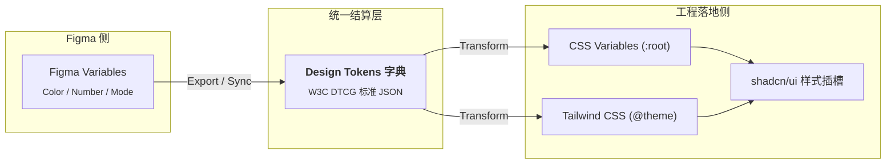
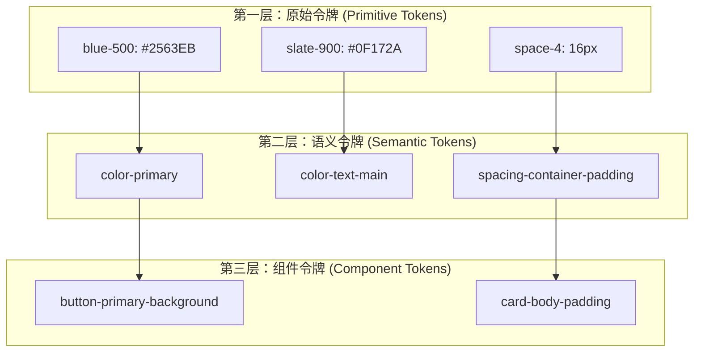
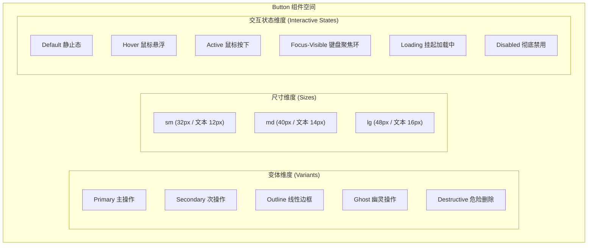
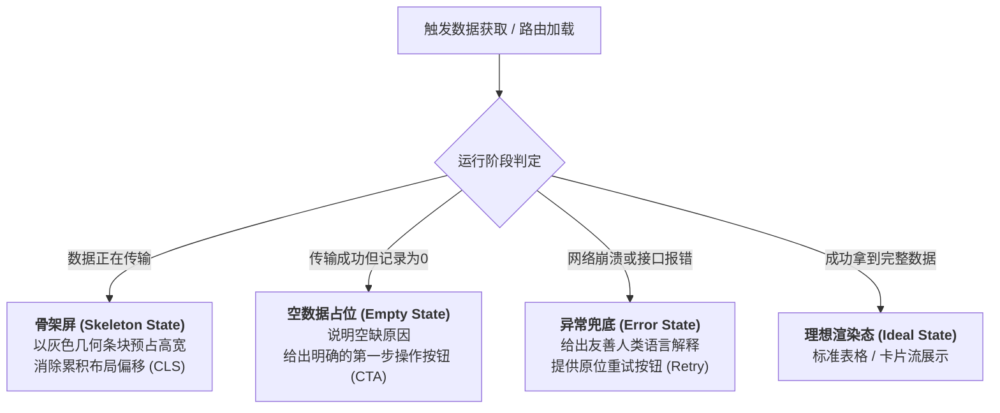

# 规范与组件化：从视觉符号到 Design Tokens 与交互状态全集

很多朋友在尝试用 AI 搭界面时，经常会遇到同一种失控：
AI 在顶部栏用了 `#2563EB`，在主要按钮里随手写了 `#1D4ED8`，到了卡片高亮处又变成了 `#3B82F6`；间距一会儿 `14px` 一会儿 `18px`，圆角更是从 `6px` 到 `15px` 随心所欲；想给页面加个暗黑模式，就得把几十处写死在类名里的十六进制颜色一个个揪出来改；更要命的是，AI 生成的按钮通常只画了一个静态的默认帧，鼠标移上去没反应、点击时没有按压反馈、数据加载时页面直接卡死、接口报错时留下一片惨白。

这种混乱的症结，不在于提示词不够客气，而在于代码库里缺乏**单一可信数据源（Single Source of Truth）**，且组件缺乏**状态完备性**。

今天我们把设计系统（Design System）工程化中最核心的两大支柱彻底拆碎：**设计令牌（Design Tokens）** 与 **组件全状态模型**。我们将梳理如何把 Figma 中的变量体系无损映射进代码，并用声明式状态机管住每一个按钮与页面的生老病死。

---

## 散装数值的隐形债务从哪来？

在没有规范约束的前提下让 AI 写代码，AI 就像一个手里拿着几百种杂色画笔但没有调色盘的画工：看到一处需要蓝色，就凭直觉从大模型概率库里抓一个十六进制数值；看到一处留白，就随手塞一个自以为顺眼的像素值。

这种散落在各个标签与样式文件里的裸露数值，在软件工程中被称为**魔数（Magic Numbers）**：

```html
<!-- 散装魔数代码示范：每一处都在凭感觉硬编码 -->
<div class="p-[17px] bg-[#f8fafc] rounded-[9px] border border-[#e2e8f0]">
  <h3 class="text-[#1e293b] text-[15px]">实时监控指标</h3>
  <p class="text-[#64748b] text-[13px] mt-[7px]">更新于 5 分钟前</p>
  <button class="bg-[#2563eb] text-white px-[13px] py-[7px] rounded-[5px]">刷新数据</button>
</div>
```

这段代码第一眼在浏览器里跑起来可能马马虎虎，但在真实工程中，它埋下了三笔巨大的隐形技术债务：

- **维护成本雪崩**：当设计团队决定将品牌主色微调为 `#1D4ED8`，或者将所有容器圆角从偏硬的圆角统一提升到更圆润的风格时，你必须在整个项目中全局搜索并人工甄别几百处类似的十六进制字符串。稍有遗漏，界面就会呈现出一种微妙但廉价的拼接感。
- **暗黑模式彻底沦为死结**：**暗黑模式（Dark Mode）** 或高对比度模式并不是对所有颜色做数学反色计算，而是视觉语义关系的重映射。背景从浅灰切到深黑，文字从深灰切到象牙白，描边可能从实体线条变为半透明微光。直接写死的颜色让根节点的主题切换根本无法生效。
- **AI 上下文污染与退化**：由于提示词缺乏刚性边界，AI 会在后续迭代中根据它自己前序生成的零散数值继续发散。经过两三轮对话微调后，间距从 `17px` 漂移到 `19px`，按钮圆角各不相同，设计资产全面失控。

**破解之道：确立设计与工程的“结算硬通货”。**
我们需要建立一套不可篡改的符号系统，让设计师在 Figma 里的每一次取色与间距定义，都能对应到代码里唯一确定的变量键名。

---

## 给样式找一套不可篡改的硬通货

什么是**设计令牌（Design Tokens）**？

官方标准组织 W3C 设计令牌社区组（DTCG）给出的定义是：*跨平台界面设计与开发中，用于存储视觉样式属性（颜色、字阶、间距、动效等）的最小不可分割数据单元。*

抛开这一串拗口的官方定义，用大白话打个生活比方：
设计令牌就像**国际贸易中的货币结算体系**。
直接在图层或代码上写 `#2563EB`、`16px`，就像原始社会以物易物，每次交易都要重新称重核验；而设计令牌则是发行了一套标准代币。设计稿和前端代码共同认准代币的名字（比如 `--color-brand-primary` 或 `--spacing-card-padding`），至于这个代币在底层到底绑定哪个物理色值，统一交给中央金库（配置文件）管理。



在工程底层，标准的设计令牌文件通常是一个结构严密的 JSON 字典：

```json
{
  "color": {
    "brand": {
      "primary": {
        "$value": "#2563eb",
        "$type": "color",
        "$description": "全站主要品牌色，用于高优先级操作按钮与强调态"
      }
    }
  },
  "spacing": {
    "card-padding": {
      "$value": "16px",
      "$type": "dimension",
      "$description": "标准信息卡片的默认内边距"
    }
  }
}
```

通过这一层抽象，设计意图与工程实现实现了完全解耦。前端代码不再关心实际的十六进制色值是多少，只要认准这个 Token 的标识符即可。

---

## 三层 Token 体系怎么划才不晕车

很多初学者一听 Token 体系，就恨不得给界面上的每一个矩形都建一个独立变量，最后维护几千个 Token 把自己绕死在迷宫里。

在成熟的工程实践中，Token 严格遵循**三层金字塔架构**：

| Token 层级 | 命名风格示范 | 角色与意图 | 生活类比 | 变动频率 |
| :--- | :--- | :--- | :--- | :--- |
| **原始层（Global / Primitive Tokens）** | `blue-500: #2563EB`<br/>`space-4: 16px` | 记录物理现实的绝对基准值，无业务语义 | 颜料桶里的原色、物理世界的米尺 | 极低（几乎终身不变） |
| **语义层（Semantic / Alias Tokens）** | `color-primary: var(--blue-500)`<br/>`color-bg-page: var(--slate-50)` | 赋予业务目的与设计意图，也是暗黑模式的切换枢纽 | 红绿灯中的“通行色”与“禁止色” | 低（品牌改版时调整） |
| **组件层（Component Tokens）** | `btn-primary-bg: var(--color-primary)`<br/>`card-padding: var(--space-4)` | 绑定到具体组件的具体插槽，隔离组件间耦合 | 某种特定品牌自动售货机的投币口规格 | 中（组件局部微调） |



### 实践原则与边界约束

- **原型期只做前两层，慎做第三层**：对于独立完成 Vibe Coding 原型的设计师来说，**原始层 + 语义层**已经能覆盖 95% 的场景。盲目过早引入组件层，会在小项目中造成过度的语法包装。如果你发现自己在写 `--button-primary-default-border-radius` 这样长得令人窒息的变量名，赶紧刹车。
- **暗黑模式的魔法只发生在语义层**：暗黑模式切换时，`blue-500` 依然是那个色值（原始层不动），改变的是 `color-bg-page` 从指向 `slate-50` 切换指向 `slate-950`。这就是语义层作为“转接插座”的核心价值。

---

## 构建一套最小必要的 Token 字典

在把规范导入代码前，我们需要在 Figma 和配置文件中收敛出原型必备的四类基础标尺。

### 色彩体系的语义矩阵

严禁让 AI 自由选色，页面色彩必须严格收敛到以下语义槽位中：

```css
:root {
  /* 基础画布与容器表面 */
  --bg-app: #f8fafc;
  --bg-surface: #ffffff;
  --bg-surface-subtle: #f1f5f9;

  /* 文本阶梯：依赖明度对比拉开层级 */
  --text-primary: #0f172a;
  --text-secondary: #475569;
  --text-muted: #94a3b8;
  --text-inverted: #ffffff;

  /* 品牌与操作主色 */
  --color-brand: #2563eb;
  --color-brand-hover: #1d4ed8;
  --color-brand-subtle: #eff6ff;

  /* 边框与分割线 */
  --border-default: #e2e8f0;
  --border-focused: #2563eb;

  /* 状态反馈色 */
  --status-success: #16a34a;
  --status-warning: #d97706;
  --status-destructive: #dc2626;
}

/* 暗黑模式重映射：仅调整语义层的指向 */
.dark {
  --bg-app: #020617;
  --bg-surface: #0f172a;
  --bg-surface-subtle: #1e293b;

  --text-primary: #f8fafc;
  --text-secondary: #94a3b8;
  --text-muted: #64748b;
  --text-inverted: #0f172a;

  --border-default: #1e293b;
  --border-focused: #3b82f6;
}
```

### 几何间距标尺与步进规约

全面锁死 **4px 几何梯队**。间距不再以随意像素存在，而是像乐高积木一样按固定步进拼装：

```text
4px 网格阶梯对照：
--space-1: 4px   (Tailwind: 1)  -> 图标与伴随文案的微距
--space-2: 8px   (Tailwind: 2)  -> 按钮内部内边距、Tag 内部间隙
--space-3: 12px  (Tailwind: 3)  -> 表单项之间紧凑间隙
--space-4: 16px  (Tailwind: 4)  -> 标准卡片内边距、列表项间距
--space-6: 24px  (Tailwind: 6)  -> 复杂卡片外留白、面板内部大留白
--space-8: 32px  (Tailwind: 8)  -> 页面级区块（Section）纵向隔离
```

### 圆角与深度标度

- **圆角标度（Radius Scale）**：
  - `--radius-sm: 4px`（小型角标 Badge、微型复选框 Checkbox）
  - `--radius-md: 8px`（标准表单输入框 Input、常规按钮 Button）
  - `--radius-lg: 12px`（内容卡片 Card、模态对话框 Modal）
  - `--radius-full: 9999px`（药丸胶囊状标签 Pill、圆形头像 Avatar）
- **投影分层（Elevation）**：
  - `shadow-sm`：平面微起伏（常规卡片描边弱辅助）
  - `shadow-md`：悬浮态与下拉菜单（Dropdown Menu）
  - `shadow-xl`：阻塞型全屏浮层（Modal 弹窗底框）

---

## Figma Variables 怎么无损直译进代码

Figma 的 **Variables** 功能，其底层数据模型与前端工程规范实现了完全对齐。

### 变量类型映射关系

| Figma Variable 类型 | 对应 Web 标准实现 | 典型适用属性 |
| :--- | :--- | :--- |
| **Color** | CSS 颜色变量（Hex / HSL / OKLCH） | 背景、文本、边框、投影 |
| **Number** | CSS 长度单位（`px` / `rem`） | Padding、Gap、Border Radius、Width / Height |
| **String** | 字体族名字、特定枚举类别 | `font-family`、`content` |
| **Boolean** | 条件渲染判断依据 / 状态开关 | 是否展示图标插槽、是否处于禁用态 |

### 映射进 Tailwind CSS 工程配置

在以 Tailwind 为底座的现代前端项目中，把 Variables 注册进系统有两种最直观的落地路径：

**方案 A：在 Tailwind v4 `@theme` 中直接声明（现代推荐）**

Tailwind CSS v4 放弃了传统的 `tailwind.config.js`，改为在 CSS 中直接声明主题映射：

```css
@import "tailwindcss";

@theme {
  --color-brand: var(--color-brand);
  --color-brand-hover: var(--color-brand-hover);
  --color-surface: var(--bg-surface);
  --color-surface-subtle: var(--bg-surface-subtle);
  
  --spacing-card: 16px;
  --radius-card: 12px;
}
```

在 HTML 或 JSX 中可以直接以语义原子类调用：`bg-surface text-brand p-card rounded-card`。

**方案 B：映射为标准 CSS 变量并透传给组件库（shadcn/ui 体系）**
在项目的全局样式表 `globals.css` 中声明 `:root` 与 `.dark` 两套模式变量。通过改变根节点的 `class="dark"`，实现全站样式的零重绘秒切。

---

## 拿到了配料表，为什么炒出来的组件还是一块木头？

配置完 `@theme` 和 `globals.css`，很多朋友往往会长舒一口气，觉得规范既然已经全部入库，接下来让 AI 写的组件自然就该是工业级的了。

但现实往往会立刻泼来一盆冷水：
你让 AI 基于这套 Token 搓一个主要按钮，它确实不再胡乱使用散装色值了，乖乖写上了 `bg-brand`、`px-4`、`rounded-md`。可一旦你把代码跑进浏览器，用鼠标移上去、按下去，或者快速连续点几下，你会发现这个按钮就像**一块刷了漂亮油漆的死木头**——悬停没有明度反馈，按压没有物理下沉，网络卡顿转圈时页面毫无动静，狂点几下甚至会向后台重复发好几次请求。

为什么有了规范的 Design Tokens，组件依然这副僵硬的半成品模样？

因为 **Design Tokens 解决的只是静态的物料清单（配料表），而真实组件是一个具备生命周期的动态容器（状态机）。**

仔细想想，真实世界中一个组件的“交互动感”到底来自哪里？
它并不是凭空产生的动画魔法，**组件状态的本质，恰恰是 Token 在用户事件与程序生命周期中的“动态重定向”**：

- **静止（Default）** 时，背景消费 `--color-brand`；
- **鼠标悬停（Hover）** 时，事件触发样式切换，背景重定向消费 `--color-brand-hover`；
- **键盘切入（Focus-Visible）** 时，外圈唤起 `--border-focused` 驱动的聚焦环；
- **挂起等待（Loading）** 时，文字插槽被替换为旋转加载器，原生点击事件被物理切断。

如果你只给 AI 规定了 Token，却没给它一套“何时切换哪个 Token”的调度剧本，Token 再工整，也只能被焊死在默认态的一潭死水里。

### 静态设计稿带来的“一帧陷阱”

AI 为什么总是把组件钉在默认态？根本原因在于**设计稿的介质局限**。

我们在 Figma 里作图时，通常习惯只画界面最光鲜亮丽的那一瞬间——有头像、有用户名、按钮端正居中。这在软件工程里被称为**理想路径（Happy Path）**。

当你把这一帧静态画面丢给 AI，它的多模态视觉模型看到的只是一张切片照片。它缺乏对“时间轴”与“用户动作”的感知，自然就会认为这个按钮在它的整个人生里，只需要安静地当一个蓝底矩形。

要让 AI 输出真正工业级、可交付的原型，我们必须在提示词和代码骨架里，强行向它注入一个**三维正交的组件空间**：



---

## 让状态机接管交互组件的生老病死

在工程实现中，组件的状态不应该由一堆散乱的 `if-else` 来拼凑，而是应该由清晰的变体组合驱动。

以行业标准库 shadcn/ui 的核心底座 **CVA（Class Variance Authority）** 为例，它用声明式对象锁死了组件的全部合法形态：

```tsx
// button.tsx：利用 CVA 实现状态完备的高保真按钮组件
import * as React from "react"
import { cva, type VariantProps } from "class-variance-authority"
import { Loader2 } from "lucide-react"

export const buttonVariants = cva(
  // 基础底座：盒模型、对齐基准、平滑过渡、键盘聚焦环与禁用态物理隔离
  "inline-flex items-center justify-center font-medium transition-all select-none focus-visible:outline-none focus-visible:ring-2 focus-visible:ring-offset-2 disabled:pointer-events-none disabled:opacity-50",
  {
    variants: {
      variant: {
        primary:
          "bg-blue-600 text-white hover:bg-blue-700 active:scale-[0.98] focus-visible:ring-blue-600 shadow-sm",
        secondary:
          "bg-slate-100 text-slate-900 hover:bg-slate-200 active:scale-[0.98] focus-visible:ring-slate-400",
        outline:
          "border border-slate-200 bg-transparent text-slate-800 hover:bg-slate-50 active:scale-[0.98] focus-visible:ring-slate-400",
        ghost:
          "bg-transparent text-slate-700 hover:bg-slate-100 active:bg-slate-200 focus-visible:ring-slate-400",
        destructive:
          "bg-rose-600 text-white hover:bg-rose-700 active:scale-[0.98] focus-visible:ring-rose-600 shadow-sm",
      },
      size: {
        sm: "h-8 px-3 text-xs rounded-md gap-1.5",
        md: "h-10 px-4 text-sm rounded-md gap-2",
        lg: "h-12 px-6 text-base rounded-lg gap-2.5",
      },
    },
    defaultVariants: {
      variant: "primary",
      size: "md",
    },
  }
)

export interface ButtonProps
  extends React.ButtonHTMLAttributes<HTMLButtonElement>,
    VariantProps<typeof buttonVariants> {
  isLoading?: boolean
}

export const Button = React.forwardRef<HTMLButtonElement, ButtonProps>(
  ({ className, variant, size, isLoading, children, disabled, ...props }, ref) => {
    return (
      <button
        ref={ref}
        disabled={disabled || isLoading}
        className={buttonVariants({ variant, size, className })}
        {...props}
      >
        {isLoading && <Loader2 className="animate-spin shrink-0 h-4 w-4" />}
        {children}
      </button>
    )
  }
)
Button.displayName = "Button"
```

### 交互状态全景对照清单

在评估 AI 生成的基础组件时，逐项核对以下 6 大状态表现：

1. **Default（默认静止态）**：视觉重心与层级符合预期。
2. **Hover（鼠标悬停态）**：明度微调（背景加深 5%~10% 或产生轻微底色衬托），指针变为手型（`cursor-pointer`）。
3. **Active（物理按压态）**：模拟按键受力，轻微的尺寸微缩（如 `active:scale-[0.98]`）或更深的明度沉降。
4. **Focus-Visible（键盘聚焦态）**：专为键盘导航设计的无障碍轮廓（`ring-2 ring-primary ring-offset-2`），鼠标点击时不应触发，仅在 Tab 键选中时清晰指示焦点。
5. **Loading（加载挂起态）**：隐藏或弱化原有文案，在原位展示旋转加载器（Spinner），锁定容器尺寸避免发生骨架跳跃，同时**必须开启 `disabled` 拦截任何二次点击**。
6. **Disabled（不可用态）**：透明度整体降至 50% 左右（`opacity-50`），鼠标变为禁止符号（`cursor-not-allowed`），并彻底剥离鼠标事件监听（`pointer-events-none`）。

---

## 页面三大空窗期的防崩塌防线

局部组件有状态，整个页面和复合模块（如：数据表格、卡片流、仪表盘）同样拥有其完整的**生命周期状态**。

很多设计师在 Figma 里只画了数据丰满、排版完美的“理想态”（Happy Path）。当交给 AI 运行，遇到网络延迟或者数据为空时，界面就会原地散架。

在原型规划中，任何承载动态数据的区域都必须具备三道防线：



### 骨架屏与布局稳定性

- **彻底弃用全屏大 Spinner**：在大版面中只放一个居中的旋转加载圆圈，会让用户产生极强的等待焦虑；且当真实数据突然灌入时，容器尺寸瞬时突变，会产生剧烈的**累积布局偏移（Cumulative Layout Shift / CLS）**。
- **推荐策略**：提取卡片与列表的几何轮廓，用淡灰色的呼吸动画块（Tailwind: `animate-pulse bg-slate-200 rounded`）在真实坐标上占位。页面在加载期和就绪期保持骨架高度一致。

```tsx
// MetricCardSkeleton.tsx：骨架屏预占位示范
export function MetricCardSkeleton() {
  return (
    <div className="p-4 rounded-xl border border-slate-200 bg-white animate-pulse">
      <div className="h-4 w-24 bg-slate-200 rounded mb-3"></div>
      <div className="h-8 w-36 bg-slate-200 rounded mb-2"></div>
      <div className="h-3 w-16 bg-slate-200 rounded"></div>
    </div>
  )
}
```

### 空状态与行动闭环

空数据不等于空白。一个合格的 Empty State 必须包含三要素：
1. **情境插画或醒目图标**（直观传达“这里目前没有内容”）；
2. **轻量解释文案**（区分是“暂无任何数据”还是“没有匹配当前筛选条件的结果”）；
3. **主行动点按钮（Call to Action / CTA）**（如：“立即创建第一条项目”或“清空所有筛选条件”）。

---

## 给 AI 戴上紧箍咒的规则工程化

知道了规范，怎么让 AI 在生成代码时老老实实执行，而不是继续胡乱发挥？

答案是：**不要依赖单次对话的临场发挥，要把规范固化进工程的上下文基础设施中。**

### 项目规则文件的上下文注入

在项目根目录下维护全局规则文件（如 `.cursorrules`、`CLAUDE.md` 或 `AGENTS.md`），明确写下刚性约束条款：

```markdown
# 样式与组件规范刚性约束

1. 严禁在样式中使用任何未经定义的十六进制颜色（Hex Color）或随意像素数值（Magic Pixels）。
2. 所有颜色必须且只能选用 `globals.css` 中声明的语义 CSS 变量或 Tailwind 预设语义代号（如 `text-primary`, `bg-surface`）。
3. 所有间距与尺寸必须严格遵循 4px 阶梯（`gap-1` 到 `gap-8`, `p-2` 到 `p-6`），严禁出现类似 `p-[13px]` 或 `mt-[7px]` 的任意值语法。
4. 任何交互组件（Button / Input / Select）必须实现 Default、Hover、Active、Focus-Visible、Loading、Disabled 的全状态支持。
5. 所有数据展示列表必须同步提供配套的 Skeleton 骨架屏与 Empty State 结构。
```

### 精准 Prompt 模版

当要求 AI 编写或重构组件时，采用结构化的三段式提问：

> **角色与输入**：请基于项目中已配置的 Tailwind 语义变量和 CVA 工具，实现一个可复用的 `MetricCard`（业务指标卡片）。  
> **状态与插槽**：
> - 变体支持：默认描边态（Default Outline）、强调填充态（Accent Surface）；
> - 状态要求：需要支持 `isLoading` 状态下的骨架屏占位，以及数值为负数时的 `destructive` 警示色映射；
> - 布局约束：严格使用 `--space-4`（`p-4`）内边距，标题与数值之间使用 `gap-1`，图标容器声明 `shrink-0`。  
> **输出要求**：直接输出包含 TypeScript 类型定义的完整 `.tsx` 代码，严禁遗漏任何状态分支。

---

## 交付走查与状态验收清单

当你或 AI 完成一个组件模块后，对照以下清单逐项验证：

- [ ] **零魔数扫描**：代码中没有未经定义的十六进制颜色或未对齐网格的任意像素数值。
- [ ] **语义层插座**：所有界面背景与主文本色均指向语义变量，切换全局暗黑模式类名时全站平稳重绘。
- [ ] **状态完整性**：按钮与输入框具备清晰的 Hover、Active、Focus-Visible、Loading 与 Disabled 表现。
- [ ] **防二次触发**：组件处于 Loading 状态时，指针事件被拦截且原生 `disabled` 属性被正确激活。
- [ ] **骨架屏尺寸锚定**：数据加载态骨架屏的高宽与真实内容完全对齐，数据灌入时视口无跳跃抖动。
- [ ] **空窗有引导**：列表在零数据时展示友好引导与清晰的 CTA 操作入口，避免留下一片死白。

---

## 下一步

到这里，我们已经把设计系统从虚浮的视觉图层，沉淀为了坚固、可复用、全状态闭环的代码组件底座。

但组件光有好看的皮囊和完备的状态还不够——它们目前依然是静态展示的木偶。真实软件的魅力在于用户输入、网络请求与数据流转。

下一篇 [[Phase 3]] 我们进入 **React 最小必要集**：彻底搞懂 Props 传参、`useState` 响应式驱动与条件/列表渲染，给这些精致的组件注入真正的灵魂。

---

## 参考链接

本篇涉及的规范标准与工程实践参考：

- [W3C Design Tokens Community Group (DTCG) Specification](https://design-tokens.github.io/community-group/format/)
- [Tailwind CSS Theme Configuration Documentation](https://tailwindcss.com/docs/theme)
- [shadcn/ui - Anatomy and Design Principles](https://ui.shadcn.com/)
- [CVA (Class Variance Authority) Official Documentation](https://cva.style/docs)
- [Radix UI Primitives - Accessible Component States](https://www.radix-ui.com/primitives)
