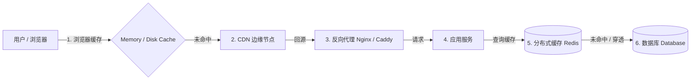
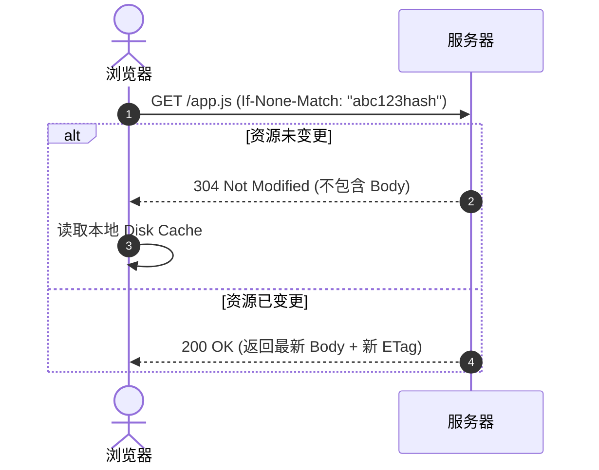
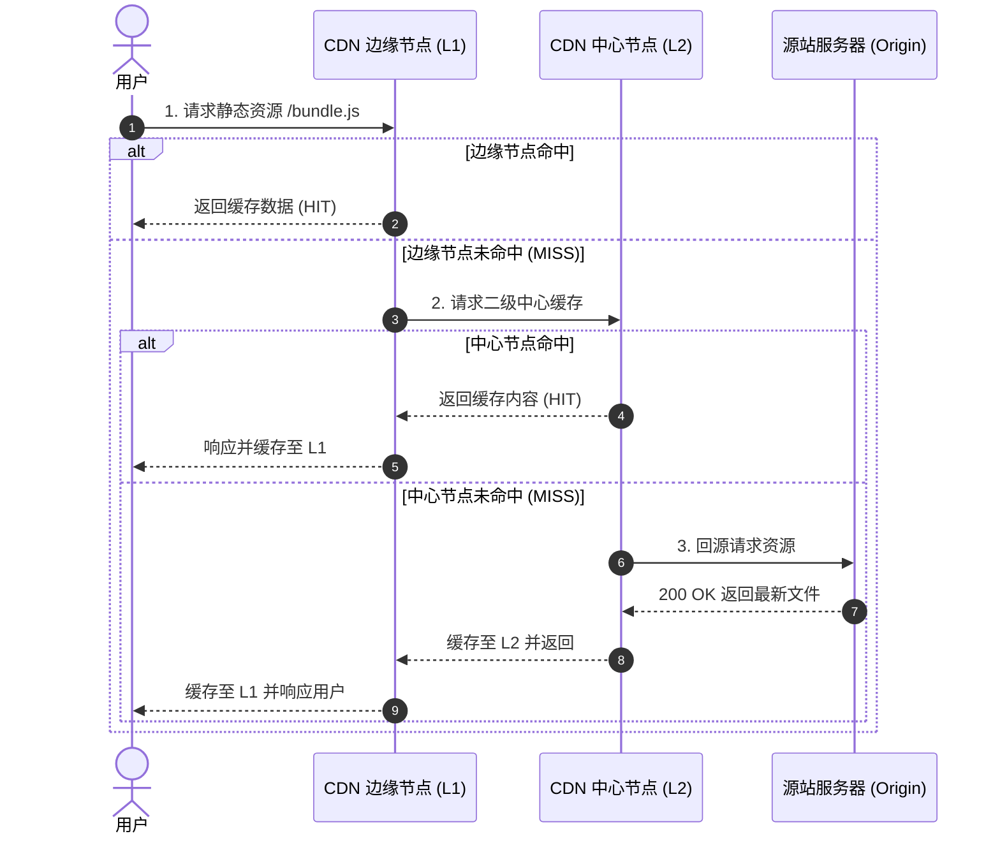
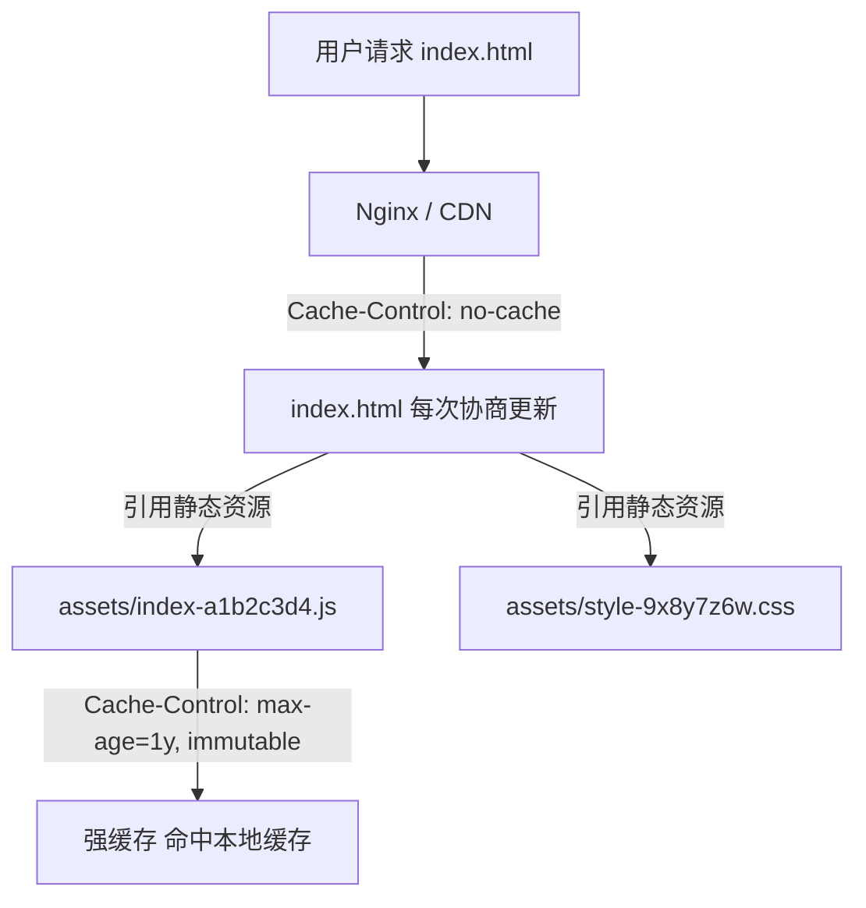
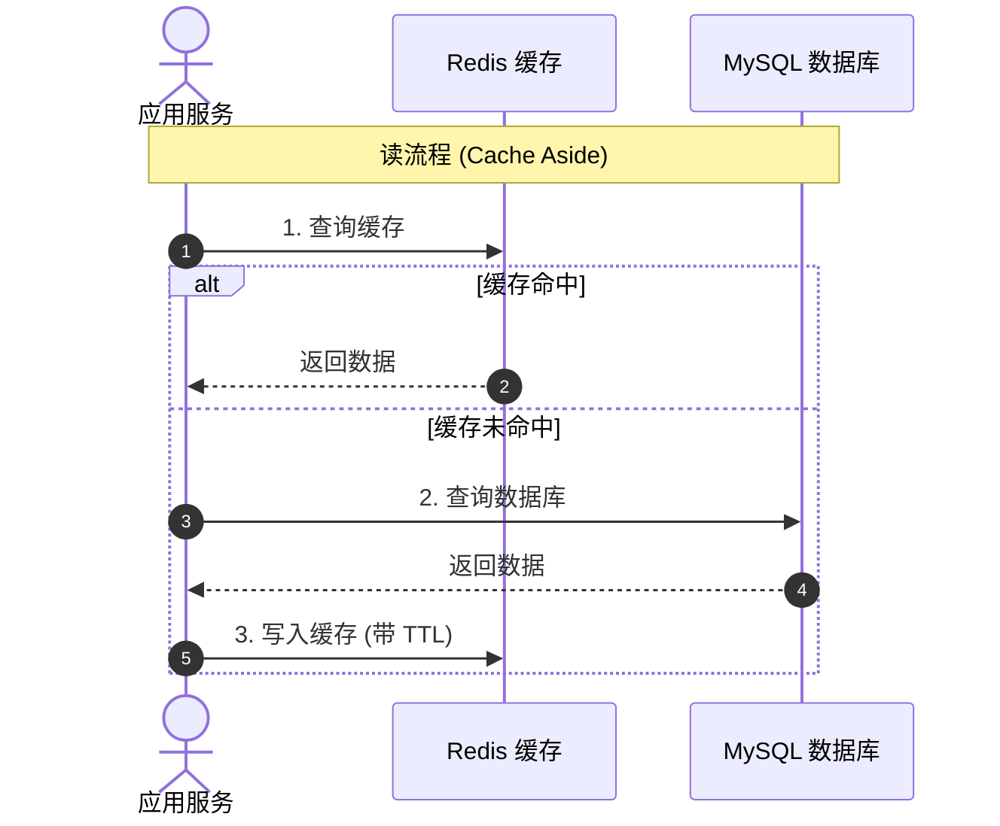

# 一文搞懂 Web 开发中的缓存体系：从浏览器到服务端

不知道大家在日常开发中，有没有遇到过这样的名场面：

> 「我刚刚明明把线上 bug 修了，为什么你那边看还是报错？」  
> 「你清一下浏览器缓存试试？」  
> 「好了，神了！」

~~只要重启和清缓存能解决的问题，都不是大问题。~~ 但作为开发者，我们总不能每次发版都让用户去按 `Ctrl + F5` 吧！

在 Web 开发的世界里，缓存就像是一把双刃剑：用得好，页面秒开、服务器压力直接打一折；用得不好，更新不及时、数据不一致等各种诡异 bug 就会接踵而至。一直以来很多小伙伴对缓存各层的流转细节不太清楚，于是今天我就把 Web 体系中的缓存从头到尾好好盘一遍。

接下来我们就来看看，一个请求从用户浏览器出发到最终触达数据库，到底经历了哪些缓存关卡 🚀。

## Web 缓存全景视角

在深入每个细节之前，我们先站在上帝视角看一眼整个缓存链路。



可以看到，缓存并不是某一个单一的技术点，而是一整套**自底向上的防御工事**。离用户越近的缓存，响应速度越快，对后端资源的保护力度也越大。

## 浏览器缓存与本地存储

当我们在浏览器地址栏敲下回车时，浏览器首先会检查本地缓存。

### 缓存位置分层

浏览器内部其实根据存储介质和用途分了好几层：

- **Memory Cache（内存缓存）**：响应速度最快（毫秒级），但生命周期短，随着 Tab 标签页关闭就会释放。通常存放当前页面已经加载过的脚本、图片等。
- **Service Worker Cache**：通过代码精准控制的离线缓存，PWA 应用的核心基石。
- **Disk Cache（磁盘缓存）**：存放在硬盘中，容量大，生命周期长，页面关闭后依然存在。

### 强缓存机制

强缓存是最省事的：**只要在有效期内，浏览器连请求都懒得发给服务器**，直接从本地拿数据，返回 HTTP 200（from disk cache / from memory cache）。

控制强缓存的主要有两个响应头：

1. `Expires`（HTTP/1.0）：返回一个绝对时间（如 `Expires: Wed, 21 Oct 2026 07:28:00 GMT`）。缺点很明显，如果客户端本地时间被篡改，缓存时间就不准了。
2. `Cache-Control`（HTTP/1.1）：现代 Web 开发的绝对主流，使用相对时间 `max-age`。

```http
HTTP/1.1 200 OK
Content-Type: application/javascript
Cache-Control: max-age=31536000, immutable
```

常见 `Cache-Control` 指令速查：

- `max-age=xxx`：资源在 xxx 秒内有效。
- `no-cache`：**千万别被名字骗了！** 它并不是「不缓存」，而是「每次使用前必须向服务器发起协商缓存确认」。
- `no-store`：真正的「彻底不缓存」，任何中间节点和客户端都不得存储副本（常用于敏感数据）。
- `public` / `private`：是否允许代理服务器（CDN 等）缓存该响应。
- `immutable`：告诉浏览器该资源永远不会变，连用户手动刷新时都无需去服务器确认。

### 协商缓存机制

当强缓存失效（或者设置了 `no-cache`）时，浏览器并不会盲目重新下载资源，而是带着凭证去问服务器：「这东西改过没？」如果没改，服务器直接返回 `304 Not Modified`，不携带 Body，省下大笔带宽。

协商缓存主要有两对请求/响应头：



这两对机制的对比如下：

| 机制 | 响应头 (Response) | 对应请求头 (Request) | 优缺点 |
| --- | --- | --- | --- |
| 基于时间 | `Last-Modified` | `If-Modified-Since` | 精度只到秒级；文件只修改元数据未改内容也会误判 |
| 基于指纹 | `ETag` | `If-None-Match` | 精度高（基于内容 Hash）；计算需要微小服务端开销 |

日常建议：**优先使用 `ETag`**，大多数现代 Web 服务器（如 Nginx）默认都开启了良好的 ETag 支持。

## CDN 边缘缓存与回源机制

当浏览器缓存未命中，请求就会飞向网络。如果直接打到源站服务器，跨地域网络延迟与源站带宽压力都会非常大。这时就需要 **CDN（Content Delivery Network）** 出马了。

### CDN 多级缓存架构原理

CDN 的本质是「空间换时间」，把静态资源推送到离用户地理位置最近的边缘机房。当用户发起请求时，DNS 解析会通过 GeoDNS / Anycast 将请求路由到最近的 CDN 边缘节点（Edge POP）。



### CDN 常用缓存控制头

除了常规的 `max-age`，CDN 还支持几个非常实用的专属控制头：

- `s-maxage=xxx`：专门给公共代理/CDN 设置的有效期。如果同时存在 `max-age=60` 和 `s-maxage=86400`，浏览器只会本地缓存 1 分钟，而 CDN 会在边缘节点缓存 1 天。
- `stale-while-revalidate=xxx`：**极致用户体验神器**。在资源过期后的 xxx 秒内，CDN 允许先将旧缓存（Stale）直接返回给用户（实现 0ms 阻塞响应），同时在后台异步向源站发起验证并更新缓存。
- `Vary` 头：告知 CDN「根据哪些请求头区分缓存副本」。例如 `Vary: Accept-Encoding` 会让 CDN 分别为支持 gzip 和 brotli 的客户端缓存两份独立的压缩包；`Vary: Origin` 则解决跨域场景下的缓存错乱问题。

## 反向代理与 Web 服务器配置

当请求穿透 CDN 回源，或者小型站点直连服务器时，Nginx 和 Caddy 等 Web 服务器就成了决定缓存规则的核心关口。

### Nginx 静态资源与反向代理缓存

在 Nginx 中，我们既可以为前端静态资源注入浏览器缓存头，也可以利用 `proxy_cache` 开启后端接口的数据缓存。

```nginx
# 1. 前端 SPA 单页应用缓存配置
server {
    listen 80;
    server_name example.com;
    root /var/www/dist;

    # HTML 文件：绝不长强缓存，要求每次协商验证
    location = /index.html {
        add_header Cache-Control "no-cache";
        expires 0;
    }

    # 带 Hash 的 JS/CSS/图片：长期强缓存 1 年
    location ~* \.(js|css|png|jpg|jpeg|gif|svg|woff2|woff)$ {
        add_header Cache-Control "public, max-age=31536000, immutable";
    }

    location / {
        try_files $uri $uri/ /index.html;
    }
}

# 2. 后端接口反向代理缓存（缓存热门只读 API）
# 定义缓存存储路径、共享内存区与过期淘汰规则
proxy_cache_path /var/cache/nginx/api levels=1:2 keys_zone=api_cache:10m max_size=1g inactive=60m use_temp_path=off;

server {
    listen 80;
    server_name api.example.com;

    location /api/v1/hot-topics {
        proxy_pass http://backend_upstream;
        proxy_cache api_cache;
        proxy_cache_valid 200 302 5m;       # 成功响应缓存 5 分钟
        proxy_cache_valid 404 1m;           # 404 缓存 1 分钟，防穿透
        proxy_cache_key $scheme$proxy_host$request_uri;
        add_header X-Cache-Status $upstream_cache_status; # 便于排查是否命中 (HIT/MISS)
    }
}
```

### Caddy 现代化缓存配置

Caddy 作为现代 Web 服务器，语法极其简洁：

```caddyfile
example.com {
    root * /var/www/dist
    file_server

    # HTML 协商缓存
    @html path /index.html
    header @html Cache-Control "no-cache"

    # 带 Hash 静态资源长期强缓存
    @static path *.js *.css *.woff2 *.svg *.png *.jpg
    header @static Cache-Control "public, max-age=31536000, immutable"

    # 单页应用路由 fallback
    try_files {path} /index.html
}
```

## 前端工程化中的缓存最佳实践

既然强缓存这么快，那更新代码时怎么办？如果所有文件都设成长期强缓存，发版时用户岂不是永远用旧代码？

现代前端工程化（Vite、Webpack、Rollup）给出了非常完美的解法：**「内容哈希 + 非对称缓存策略」**。



### 黄金配置法则

- **HTML 文件**：绝不设置长强缓存，配置 `Cache-Control: no-cache`。确保用户每次打开网页都能拿到最新的入口 HTML。
- **静态资源（JS / CSS / 图片）**：打包时通过文件名注入 Content Hash（如 `app.7f8b2d.js`）。配置长时间强缓存：`Cache-Control: max-age=31536000, immutable`。

这样一来，只要代码变更，打包出来的文件名就会变，HTML 中引用的路径随之改变；没有变更的文件则继续坚守本地强缓存，实现了「极致性能」与「秒级更新」的完美共存。

## 服务端与数据库缓存防线

跨过了客户端、CDN 和反向代理，请求终于来到了服务端。数据库的 I/O 和并发承载力通常是系统最脆弱的环节，因此服务端引入 Redis / Memcached 几乎是标准配置。

### 常见的读写策略 Cache Aside

这是最经典的缓存读写模式：

- **读操作**：先查缓存，命中则返回；未命中则查数据库，再写入缓存。
- **写操作**：先更新数据库，再淘汰（删除）缓存。



### 服务端缓存三大经典问题

在享受 Redis 带来的飞速体验时，我们必须防范以下三个经典大坑：

#### 缓存穿透

- **现象**：查询一个**根本不存在的数据**（如 `id = -9999`），缓存没有，请求每次都打到数据库，在高并发下可能直接把数据库打崩。
- **解法**：
  - **空值缓存**：即使数据库查出来是 null，也往缓存写一个带较短过期时间（如 1~2 分钟）的空值。
  - **布隆过滤器（Bloom Filter）**：在访问缓存前，先通过布隆过滤器拦截非法 key。

#### 缓存击穿

- **现象**：某个**超级热点 key** 突然过期，同一瞬间千万级并发涌入，越过缓存直接冲垮数据库。
- **解法**：
  - **互斥锁（Mutex Lock）**：只允许一个线程去查库重建缓存，其他线程等待重试。
  - **逻辑不过期**：不设置物理 TTL，由后台异步任务定期刷新数据。

#### 缓存雪崩

- **现象**：大量缓存在**同一时间集中失效**，或者 Redis 实例宕机，导致流量全盘倾泻到数据库。
- **解法**：
  - **随机 TTL**：在基础过期时间上加上随机偏移量（如 `expire = 3600 + random(1, 300)`）。
  - **高可用架构**：Redis Sentinel 或 Redis Cluster，搭配应用端本地多级缓存（如 Caffeine）。

## 个人踩坑与实践心得

聊完原理，总结几条我自己在实际项目中踩过的血泪教训：

- **Nginx 忘记关 HTML 强缓存**：当年刚用单页应用（SPA）时，打包部署后用户反馈没更新。排查半天发现 Nginx 配置了全局 `expires 7d;`，连带 `index.html` 一起被强缓存了整整 7 天……从此深刻记住：**HTML 一定要单独设置 `Cache-Control: no-cache`**。
- **删除缓存还是更新缓存**：很多人喜欢在更新数据库后直接 `setCache`，但并发场景下很容易出现后更新的数据被先更新的数据覆盖。**建议优先使用删除缓存（Delete），等下次读取时惰性重建**。
- **跨域与 Vary 头**：如果你的静态资源上了 CDN 且有跨域需求，记得配置 `Vary: Origin`，否则不同域名的请求命中同一个 CDN 缓存时可能会报 CORS 错误。

## 总结

搞定 Web 缓存，核心就在于理解各层缓存的角色分工：

- **浏览器层**：善用「Hash 文件名 + 非对称缓存」，把无感知秒开做到极致。
- **边缘与反向代理层**：合理利用 CDN 分发、`s-maxage` 以及 Web 服务器配置回源与代理缓存。
- **服务端**：遵循 Cache-Aside 模式，防范穿透、击穿与雪崩，守护好数据库底线。

计算机科学界有句名言：「计算机科学只有两件难事：缓存失效与命名。」希望这篇文章能帮你理清脉络，在今后的架构设计中不再被缓存问题所困扰！

## 参考链接

- [MDN Web Docs: HTTP 缓存](https://developer.mozilla.org/zh-CN/docs/Web/HTTP/Caching)
- [Google Web Fundamentals: HTTP 缓存指南](https://web.dev/http-cache/)
- [Nginx 官方文档：HTTP Proxy Module Caching](https://nginx.org/en/docs/http/ngx_http_proxy_module.html)
- [Caddy 官方文档：header 指令配置](https://caddyserver.com/docs/caddyfile/directives/header)
- [Redis 官方文档：Caching Best Practices](https://redis.io/docs/)
