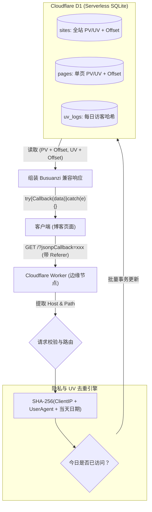

# 用 Cloudflare Workers + D1 复刻不蒜子

日常打开自己博客的 F12 控制台，网络请求面板里赫然躺着一排红色的阻断报错：

```text
GET https://static.cloudflareinsights.com/beacon.min.js/... net::ERR_BLOCKED_BY_CLIENT
theme.3NXQQgTx.js:312 GET https://busuanzi.ibruce.info/busuanzi?jsonpCallback=BusuanziCallback_... net::ERR_BLOCKED_BY_CLIENT
rocket-loader.min.js:1 A preload for '.../app.CzVAf4iF.js' is found, but is not used because the request credentials mode does not match...
```

顺手排查了一眼：
1. `rocket-loader.min.js` 是 Cloudflare 早期给老式多脚本站点搞的异步黑魔法，在现代 VitePress 的 ESM 预加载（`modulepreload`）面前纯属添乱，不仅抢跑导致凭据模式不匹配，还白白废弃了预加载缓存。这个好办，进 Cloudflare 控制台把 Rocket Loader 关掉，世界立马清静。
2. 真正让我不爽的是第二条：**不蒜子（Busuanzi）被广告拦截插件给办了。**

查了查规则库，uBlock Origin 和 AdGuard 内置的 EasyPrivacy 规则清单里早早躺着这两行：

```text
||busuanzi.ibruce.info^
*busuanzi*
```

任何发往 `busuanzi.ibruce.info` 的请求，或者 URL 路径参数里带着 `busuanzi` 关键词的打点，在浏览器网络层直接掐断。再加上不蒜子近几年服务器隔三岔五 502、历史数据偶尔归零、数据不掌握在自己手里……是时候彻底拔掉它了。

---

## 套个反代行不行？

第一反应其实想过偷懒：写个几行代码的 Cloudflare Worker，把 `https://busuanzi.ibruce.info/busuanzi` 反代一下，套上自己的域名，伪装掉路径里的关键字，顺便把 `Referer` 透传过去。

但稍微一琢磨就放弃了：
* 源站依然是脆弱的单点，一旦遭遇 502 甚至停服，反代跟着报错，数据依旧不在自己手里；
* UV 统计逻辑是个黑盒，也没法给旧文章手动修正历史浏览量。

既然博客本身就挂在 Cloudflare 后面，每天 10 万次 Worker 调用和 D1 数据库 500 万次免费读取额度闲着也是闲着，不如直接撸一个**完全兼容不蒜子协议、但数据完全属于自己的独立服务**。

我给这个项目起名叫 `counter`。

---

## 边缘去重与协议兼容

原版不蒜子之所以当年能风靡独立博客圈，核心在于**零配置**：
前端不需要申请任何 `app_id` 或 `secret`，脚本只管发起 JSONP 请求，服务端从 HTTP `Referer` 标头中提取出当前网页的 `hostname` 和 `pathname`，自动隔离站点与路由。

自建服务必须继承这个优点，同时补齐原版的短板：



### UV 计算与哈希去重
很多简易计数器直接按 PV 的百分比（比如 `PV * 0.6`）去猜 UV，或者往数据库里硬写明文 IP。前者太假，后者既有隐私泄露风险，也浪费存储。

我的做法是用 Web Crypto API 现场算一次哈希：

```typescript
const clientIp = request.headers.get("cf-connecting-ip") || "127.0.0.1"
const userAgent = request.headers.get("user-agent") || ""
const today = new Date().toISOString().slice(0, 10)

// IP + UA + 日期盐值，不可逆，且跨天自动变更
const visitorHash = await sha256(`${clientIp}-${userAgent}-${today}`)
```

把这个 `visitorHash` 结合当前日期记到表里。如果当天已有记录，说明是老访客刷新页面，只涨 PV，不涨 UV；跨天之后盐值自动变了，又算作新的一天。整个过程不需要存 Cookie，也不存真实 IP。

### 历史访问量平移
原版不蒜子最折磨人的就是“数据丢失从零开始”。

在表结构里，我给站点（`sites`）和单页（`pages`）都加了 `offset_pv` 和 `offset_uv` 字段。查询返回时：
$$\text{对外展示 PV} = \text{真实累计 PV} + \text{offset\_pv}$$

如果想把之前文章攒的几千浏览量平移过来，调一个带 Token 的 Admin API 把 `offset_pv` 设上，页面展示立马无缝衔接。

---

## D1 表结构与批处理

表结构简洁明了：

```sql
CREATE TABLE IF NOT EXISTS sites (
  domain TEXT PRIMARY KEY,
  site_pv INTEGER NOT NULL DEFAULT 0,
  site_uv INTEGER NOT NULL DEFAULT 0,
  offset_pv INTEGER NOT NULL DEFAULT 0,
  offset_uv INTEGER NOT NULL DEFAULT 0,
  created_at DATETIME DEFAULT CURRENT_TIMESTAMP,
  updated_at DATETIME DEFAULT CURRENT_TIMESTAMP
);

CREATE TABLE IF NOT EXISTS pages (
  domain TEXT NOT NULL,
  path TEXT NOT NULL,
  page_pv INTEGER NOT NULL DEFAULT 0,
  page_uv INTEGER NOT NULL DEFAULT 0,
  offset_pv INTEGER NOT NULL DEFAULT 0,
  offset_uv INTEGER NOT NULL DEFAULT 0,
  PRIMARY KEY (domain, path)
);

CREATE TABLE IF NOT EXISTS uv_logs (
  domain TEXT NOT NULL,
  path TEXT NOT NULL,
  visitor_hash TEXT NOT NULL,
  log_date TEXT NOT NULL,
  PRIMARY KEY (domain, path, visitor_hash, log_date)
);
```

有了 D1 的 Batch API，整个打点过程可以用一次 SQLite 事务原子完成，不需要担心并发下的脏读写：

```typescript
await db.batch([
  // 记录 UV 幂等日志（存在就忽略）
  db.prepare("INSERT OR IGNORE INTO uv_logs (domain, path, visitor_hash, log_date) VALUES (?, ?, ?, ?)").bind(domain, "*", visitorHash, today),
  db.prepare("INSERT OR IGNORE INTO uv_logs (domain, path, visitor_hash, log_date) VALUES (?, ?, ?, ?)").bind(domain, path, visitorHash, today),

  // 原子递增全站数据
  db.prepare(`
    INSERT INTO sites (domain, site_pv, site_uv) VALUES (?, 1, ?)
    ON CONFLICT(domain) DO UPDATE SET
      site_pv = site_pv + 1,
      site_uv = site_uv + ?
  `).bind(domain, isNewSiteUv ? 1 : 0, isNewSiteUv ? 1 : 0),

  // 原子递增单页数据
  db.prepare(`
    INSERT INTO pages (domain, path, page_pv, page_uv) VALUES (?, ?, 1, ?)
    ON CONFLICT(domain, path) DO UPDATE SET
      page_pv = page_pv + 1,
      page_uv = page_uv + ?
  `).bind(domain, path, isNewPageUv ? 1 : 0, isNewPageUv ? 1 : 0)
])
```

---

## 运行时配置踩坑

服务写完推上 Cloudflare Workers 后，用 curl 模拟测试请求：

```bash
curl -i "https://counter.booling.cn/?jsonpCallback=TestCb_123" \
  -H "Referer: https://blog.booling.cn/test"
```

结果返回了 500 状态码：

```json
{"error":"Failed to record count","message":"Cannot read properties of undefined (reading 'prepare')"}
```

报的是找不到 `prepare` 方法。这意味着 `env.DB` 压根没绑上。

翻了翻 `wrangler.toml`，发现之前在绑定 D1 时顺手写成了：

```toml
[[d1_databases]]
binding = "counter_db"
database_name = "counter-db"
database_id = "xxxxxx"
```

而代码里一直写的是 `env.DB.prepare(...)`。Cloudflare Worker 的类型系统在本地编译时查不出配置文件的键名不一致，上线运行时直接抓瞎。

解决方法也干脆，在 `types.ts` 和入口处做一层容错兼容：

```typescript
const db = env.DB || env.counter_db
if (!db) {
  return new Response(
    JSON.stringify({ error: "D1 database binding not configured" }),
    { status: 500 }
  )
}
```

重新发布，再次测试：

```text
HTTP/2 200 
content-type: application/javascript; charset=utf-8

try{TestCb_123({"site_pv":1,"site_uv":1,"page_pv":1,"page_uv":1,"version":2.4});}catch(e){}
```

再次回车执行一次，`site_pv` 变成了 2，而由于是同一个客户端哈希，`site_uv` 依然稳稳停在 1。去重和计数完全符合预期。

---

## 前端集成与特征脱敏

后端搭好了，前端怎么接？

最省事的办法是在客户端代码里只把 `busuanzi.ibruce.info` 换成 `counter.booling.cn`。但既然要摆脱规则库的拦截，就必须做得彻底：**不仅域名不能涉黑，请求 URL、函数名、DOM 属性都别留任何 `busuanzi` 蛛丝马迹。**

### 脚本与回调处理
直接把 `theme/scripts/busuanzi.ts` 删掉，重写为 `theme/scripts/counter.ts`。

原本的 JSONP 回调是 `BusuanziCallback_123456`，有些拦截器会根据 query 里的关键词封杀，直接改成：

```typescript
const callbackName = `CounterCallback_${Math.floor(1099511627776 * Math.random())}`
script.src = `https://counter.booling.cn/?jsonpCallback=${callbackName}`
```

### 组件数据绑定
VitePress 的主题组件里，顺手把原本写死的 ID 和样式类名全换了：

* `busuanzi_container_site_pv` -> `counter_container_site_pv`
* `busuanzi_value_site_pv` -> `counter_value_site_pv`
* `busuanzi-stats` -> `counter-stats`

在 `Copyright.vue` 和 `MyLayout.vue` 里，直接通过 Vue 响应式变量 `counterData.pagePv` / `counterData.sitePv` 双向绑定。即使在网络极差或离线环境下，脚本也内置了本地 localhost 开发模式的排版兜底，页面不会出现突兀的白块或布局跳动。

---

## 带着拦截插件实测验收

集成完毕后打包上线。重新开启带有 uBlock Origin 和 AdGuard 的浏览器，深度刷新博客页面。

打开控制台的 Network 标签页：
* `net::ERR_BLOCKED_BY_CLIENT` 报错彻底消失；
* 请求正常发往自定义域名 `counter.booling.cn`，状态码返回 200；
* 页脚的全站 PV/UV 与文章阅读量正常渲染展示。

整个服务跑在 Cloudflare 免费配额内，无需独立服务器运维，也摆脱了第三方公共服务的可用性波动与数据丢失风险。数据持久化在自己的 D1 中，具备完全的导出与备份控制权。

无论采用何种统计实现，核心都在于用最低的运维成本保证数据的归属权与可用性。

# 参考链接

- [Cloudflare D1 Documentation](https://developers.cloudflare.com/d1/)
- [EasyPrivacy Tracking Protection List](https://easylist.to/)
- [Busuanzi 官方站点](https://busuanzi.ibruce.info/)
